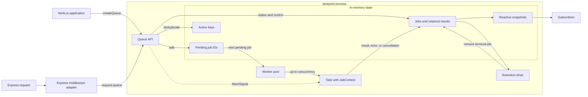

# lanepool

An in-memory, framework-neutral processing queue for Node.js with an Express middleware adapter.

## Requirements

- Node.js 20.19 or newer
- Express 4.18 or 5 when using the middleware adapter

## Installation

```sh
npm install lanepool express
```

## Express

```ts
import express from 'express';
import { createQueueMiddleware } from 'lanepool';

const app = express();
const queueMiddleware = createQueueMiddleware({ concurrency: 5 });

app.use(queueMiddleware);

app.post('/sync/:repo', (request, response) => {
  const { repo } = request.params;
  const jobId = request.queue.add(
    ({ signal }) => syncRepo(repo, { signal }),
    { key: `repo:${repo}`, meta: { repo } },
  );

  response.status(202).json({ jobId });
});

app.get('/jobs/:id', (request, response) => {
  const status = request.queue.getStatus(request.params.id);
  if (!status) {
    response.sendStatus(404);
    return;
  }
  response.json(status);
});
```

The Express type augmentation adds `queue` to `Express.Request` when this package is imported.

## Framework-neutral usage

```ts
import { createQueue } from 'lanepool';

const queue = createQueue({
  concurrency: 5,
  restIntervalMs: 100,
  idlePollIntervalMs: 1_000,
  retentionMs: 60 * 60 * 1_000,
  storeResults: true,
});

const unsubscribe = queue.subscribe(
  ({ stats }) => console.log(stats),
  { immediate: true },
);

const jobId = queue.add(async ({ signal, meta }) => {
  return runTask({ signal, meta });
});

queue.pause();
queue.resume();
queue.cancel(jobId);

unsubscribe();
await queue.close({ drain: true });
```

## Architecture



Both entry points share the same queue core. The Express adapter only attaches a queue instance to
each request; scheduling, key-based deduplication, cancellation, snapshots, and retention remain in
the framework-neutral core. Workers run in the current Node.js process, so the queue and its retained
job state are not shared across processes or persisted across restarts.

## Behaviour

- Jobs are retained only in the current process.
- An active `key` is deduplicated and `add` returns the existing job ID.
- Cancellation of running work is cooperative through `AbortSignal`.
- Workers independently observe `restIntervalMs` after finishing a job.
- Terminal jobs are removed after `retentionMs`; use `0` for immediate removal.
- `close({ drain: true })` drains queued work. `drain: false` cancels queued work and requests cancellation of running work.

## Development

```sh
npm run check
npm run build
npm run test:package
npm run docs
```

The development configuration is shared through `super-configs`: its ESLint factory enables typed
Node.js and Jest rules, while Biome, Jest, and TypeDoc extend the corresponding package presets.
