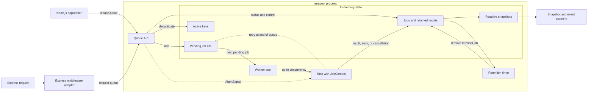

# lanepool

An in-memory, framework-neutral processing queue for Node.js with an Express middleware adapter.

## Requirements

- Node.js 20.19 or newer
- Express 4.18 or 5 when using the middleware adapter

## Installation

```sh
npm install lanepool express
```

## Express

```ts
import express from 'express';
import { createQueueMiddleware } from 'lanepool';

const app = express();
const queueMiddleware = createQueueMiddleware({ concurrency: 5 });

app.use(queueMiddleware);

app.post('/sync/:repo', (request, response) => {
  const { repo } = request.params;
  const jobId = request.queue.add(
    ({ signal }) => syncRepo(repo, { signal }),
    { key: `repo:${repo}`, meta: { repo } },
  );

  response.status(202).json({ jobId });
});

app.get('/jobs/:id', (request, response) => {
  const status = request.queue.getStatus(request.params.id);
  if (!status) {
    response.sendStatus(404);
    return;
  }
  response.json(status);
});
```

The Express type augmentation adds `queue` to `Express.Request` when this package is imported.

### Asynchronous concurrent database writes

Lanepool can move database writes out of the request lifecycle and process them concurrently with a
controlled level of parallelism. In this webhook example, the event ID is used both as the active
queue key and as a unique database key: the queue prevents concurrent duplicates, while the database
constraint keeps later redeliveries idempotent.

```ts
import express from 'express';
import { Pool } from 'pg';
import { createQueueMiddleware } from 'lanepool';

const app = express();
const database = new Pool({ connectionString: process.env.DATABASE_URL });

app.use(express.json());
app.use(createQueueMiddleware({ concurrency: 4 }));

app.post('/webhooks/orders', (request, response) => {
  const event = request.body as {
    id: string;
    orderId: string;
    total: number;
    items: Array<{ sku: string; quantity: number }>;
  };

  const jobId = request.queue.add(
    async ({ attempt }) => {
      await database.query({
        text: `
          INSERT INTO order_events (event_id, order_id, total, received_at)
          VALUES ($1, $2, $3, NOW())
          ON CONFLICT (event_id) DO NOTHING
        `,
        values: [event.id, event.orderId, event.total],
      });

      console.log(`Stored webhook ${event.id} on attempt ${attempt}`);
    },
    {
      key: `webhook:${event.id}`,
      maxAttempts: 2,
      meta: { eventId: event.id },
    },
  );

  response.status(202).json({ jobId });
});
```

`maxAttempts: 2` means one initial execution and one retry. If the first execution throws, the job
returns to `pending` at the end of the queue, allowing already queued work to run first. If the
second execution also throws, the job becomes `failed` and its normalized error is retained. The
active `key` remains reserved across attempts.

This pattern acknowledges the webhook before the database write finishes. Because lanepool is
in-memory, a process crash can lose accepted work; use a durable external queue when the webhook
must have guaranteed delivery. The database operation should still be idempotent because providers
can redeliver events after the original job has finished.

### Parent jobs with dependencies

Use a workflow when a larger operation contains jobs that must run in a specific order. The workflow
acts as the parent, while each named entry is a child job in a directed acyclic graph.

```ts
const workflowId = request.queue.addWorkflow({
  meta: { eventId: event.id, orderId: event.orderId },
  jobs: {
    insertOrder: {
      maxAttempts: 2,
      run: () => insertOrder(event),
    },
    insertItems: {
      dependsOn: ['insertOrder'],
      maxAttempts: 2,
      run: () => insertItems(event.orderId, event.items),
    },
    updateInventory: {
      dependsOn: ['insertItems'],
      run: () => updateInventory(event.items),
    },
    writeAuditLog: {
      dependsOn: ['insertOrder', 'updateInventory'],
      run: () => writeAuditLog(event),
    },
  },
});

const workflow = request.queue.getWorkflowStatus(workflowId);
console.log(workflow?.state, workflow?.jobs);
```

Jobs without dependencies are queued immediately. A blocked job is appended to the queue only after
all its dependencies complete successfully, and it does not occupy a worker while waiting. If a job
fails after exhausting its attempts or is cancelled, its descendants become `skipped`; independent
branches continue running. Workflows with missing dependencies or cycles are rejected before any job
is queued.

## Framework-neutral usage

```ts
import { createQueue } from 'lanepool';

const queue = createQueue({
  concurrency: 5,
  restIntervalMs: 100,
  idlePollIntervalMs: 1_000,
  retentionMs: 60 * 60 * 1_000,
  storeResults: true,
});

const unsubscribe = queue.subscribe(
  ({ stats }) => console.log(stats),
  { immediate: true },
);

const jobId = queue.add(async ({ signal, meta }) => {
  return runTask({ signal, meta });
});

queue.pause();
queue.resume();
queue.cancel(jobId);

unsubscribe();
await queue.close({ drain: true });
```

## Events

Use `on` for individual lifecycle events and `subscribe` when you need complete reactive snapshots.
Every listener returns an unsubscribe function and can also be tied to an `AbortSignal`.

```ts
const queue = createQueue({ concurrency: 4 });

const stopErrors = queue.on('error', ({ job, error, willRetry }) => {
  logger.error(
    { jobId: job.id, attempt: job.attempt, willRetry, error },
    'Queue task failed',
  );
});

const stopCompleted = queue.on('completed', ({ job }) => {
  logger.info({ jobId: job.id, result: job.result }, 'Queue task completed');
});

const listenerController = new AbortController();

queue.on(
  'retrying',
  ({ job, error }) => {
    console.log(`Retrying ${job.id} after attempt ${job.attempt}: ${error.message}`);
  },
  { signal: listenerController.signal },
);

listenerController.abort();
stopErrors();
stopCompleted();
await queue.close();
```

The available events are `added`, `started`, `retrying`, `completed`, `failed`, `cancelled`, and
`error`. The `error` event fires whenever a task attempt throws and includes `willRetry`; `failed`
fires only after the job exhausts `maxAttempts`. Unlike Node.js `EventEmitter`, an unhandled `error`
event does not throw, and listener exceptions do not affect job execution.

## Architecture



Both entry points share the same queue core. The Express adapter only attaches a queue instance to
each request; scheduling, key-based deduplication, cancellation, snapshots, and retention remain in
the framework-neutral core. Workers run in the current Node.js process, so the queue and its retained
job state are not shared across processes or persisted across restarts.

## Behaviour

- Jobs are retained only in the current process.
- An active `key` is deduplicated and `add` returns the existing job ID.
- Failed jobs retry at the end of the queue until `maxAttempts` is exhausted.
- Workflow jobs wait for their dependencies without occupying workers.
- Failed or cancelled workflow jobs skip their descendants while independent branches continue.
- Cancellation of running work is cooperative through `AbortSignal`.
- Workers independently observe `restIntervalMs` after finishing a job.
- Terminal jobs are removed after `retentionMs`; use `0` for immediate removal.
- `close({ drain: true })` drains queued work. `drain: false` cancels queued work and requests cancellation of running work.

## Development

```sh
npm run check
npm run build
npm run test:package
npm run docs
```

The development configuration is shared through `super-configs`: its ESLint factory enables typed
Node.js and Jest rules, while Biome, Jest, and TypeDoc extend the corresponding package presets.

## Releases

Versioning, the changelog, npm publishing, and GitHub releases are automated with
[semantic-release](https://semantic-release.gitbook.io/) based on
[Conventional Commits](https://www.conventionalcommits.org/) (`feat:`, `fix:`, `docs:`, etc.) merged
into `main`. Every push to `main` runs the `Release` workflow, which determines the next version from
the commit history, updates `CHANGELOG.md`, publishes the package to npm, and creates a GitHub release
and tag. Pull requests are validated by the `CI` workflow (`npm run check` + `npm run build`) before
they can be merged.
